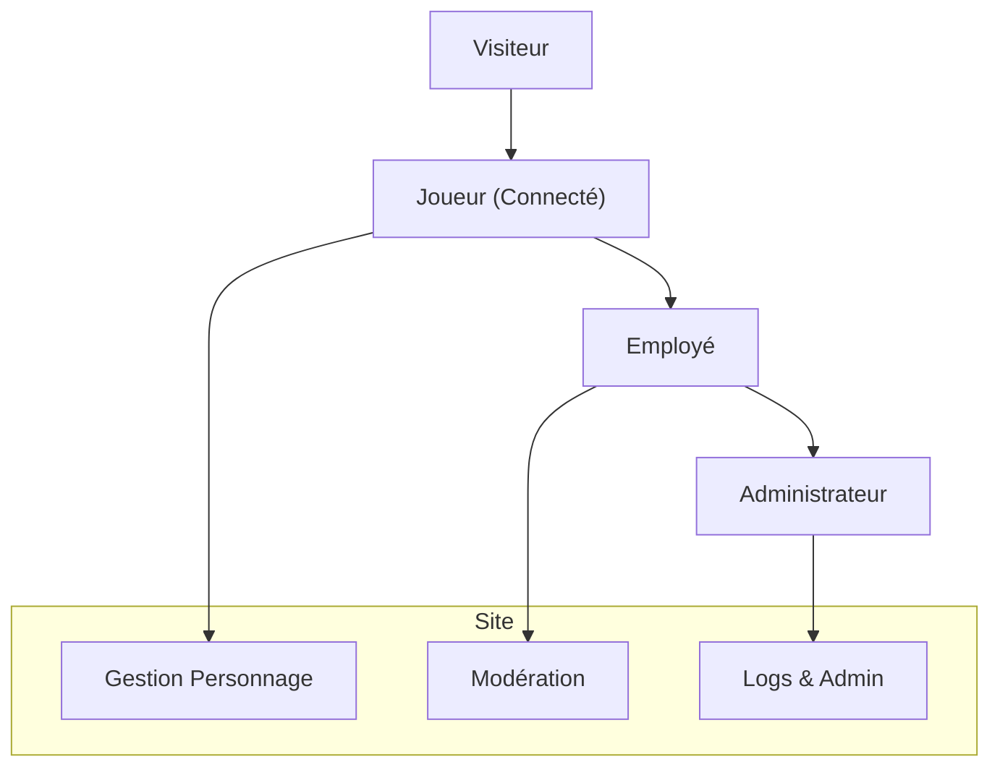
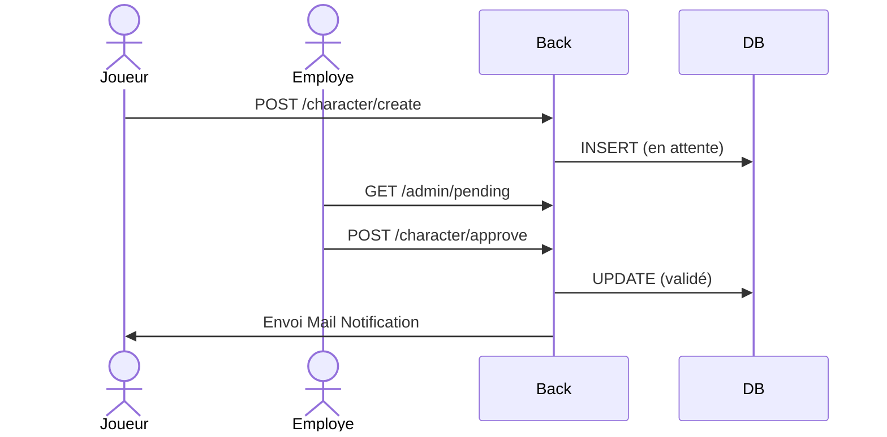
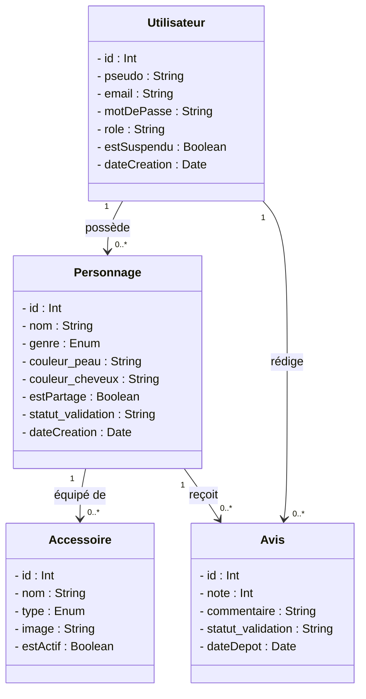

# Documentation Technique - PixelVerse

## 1. Architecture
L'application utilise une architecture **MVC (Modèle-Vue-Contrôleur)** personnalisée en PHP Natif.
- **Router** : Système de routage d'URL basé sur les segments, permettant des URLs propres (ex: `/admin/logs`).
- **Autoloader** : Chargement automatique des classes via les namespaces `PixelVerseApp`.
- **Modèles** : Gèrent la logique de données (MySQL via PDO, MongoDB via le driver PHP).
- **Vues** : Fichiers PHP/HTML utilisant un système de Layout centralisé (`BaseController::render`).

## 2. Modèle de Données
### Relationnel (MySQL)
L'ERD (MCD) comprend les entités suivantes :
- `utilisateurs` : Gère les rôles (`admin`, `employe`, `joueur`), l'authentification (Argon2id) et la récupération de compte (`reset_token`).
- `personnages` : Stocke l'apparence physique, l'appartenance à un utilisateur et le statut de modération.
- `accessoires` : Bibliothèque d'objets (armes, armures, visages) utilisable pour la personnalisation.
- `personnage_accessoire` : Table de liaison gérant l'équipement des personnages.
- `avis` : Système de notations et commentaires soumis à validation.

### Non-Relationnel (MongoDB)
Utilisé pour les **Logs d'activité** (Audit Trail) :
- `admin_logs` : Enregistre chaque action sensible (création employé, suspension utilisateur, modération avis) avec les détails JSON de l'action.

## 3. Sécurité & Qualité
- **Mots de passe** : Utilisation de `PASSWORD_ARGON2ID` avec contraintes de complexité (Regex : 1 Majuscule, 1 Minuscule, 1 Chiffre, 1 Caractère spécial).
- **Injections SQL** : Requêtes préparées systématiques avec PDO.
- **XSS & CSRF** : Échappement des sorties via `htmlspecialchars` et protection des formulaires par jetons CSRF.
- **Tests** : Suite de tests unitaires et d'intégration avec **PHPUnit**.
- **Accessibilité** : Respect des critères **RGAA** (Contrastes, Aria-labels, navigation clavier).

## 4. Diagrammes UML

### 4.1 Cas d'Utilisation (Use Case)
Ce diagramme illustre les interactions des différents acteurs (Visiteur, Joueur, Employé, Admin) avec le système.



### 4.2 Diagramme de Séquence (Création de Personnage)
Flux de données lors de la création et de la validation par un employé.



### 4.3 Modèle Conceptuel de Données (Diagramme de Classes)



## 5. Choix Technologiques
- **PHP Natif (MVC)** : Choisi pour démontrer une maîtrise totale de l'architecture sans framework.
- **MySQL** : Utilisé pour les données persistantes et relationnelles (Utilisateurs, Personnages).
- **MongoDB** : Choisi pour sa flexibilité sur les logs d'audit (NoSQL), permettant de stocker des structures de données variées sans modifier le schéma relationnel.
- **Docker** : Pour garantir une reproductibilité parfaite de l'environnement de développement et de production.
- **Fly.io** : Plateforme de déploiement choisie pour sa gestion robuste des secrets et sa scalabilité.

## 6. Accessibilité & RGPD
- Respect des standards **RGAA** (accessibilité clavier, contrastes).
- Conformité **RGPD** (consentement à l'inscription, transparence des logs).

## 7. Structure NoSQL (MongoDB)
La collection `admin_logs` est utilisée pour tracer toutes les actions critiques effectuées par les administrateurs et employés dans le back-office.

### Structure du Document JSON
```json
{
  "_id": "ObjectId",
  "admin_id": "integer", // ID de l'utilisateur (SQL) ayant effectué l'action
  "action": "string",    // Type d'action (ex: "creation_employe", "suppression_utilisateur")
  "target_id": "string", // ID ou description de l'entité affectée
  "date": "ISODate",     // Horodatage de l'action
  "details": "array"     // Données supplémentaires sur l'action
}
```

### Justification du choix NoSQL
- **Flexibilité** : Les détails des logs varient selon l'action (changement de pseudo, suspension, modération).
- **Isolation** : Les écritures massives de logs n'impactent pas les performances de la base de données relationnelle principale (MySQL).
- **Audit Trail** : Permet de conserver un historique immuable et facile à consulter pour l'administrateur.
